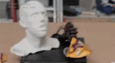

# Pipettin' GRBL

Pipetting robotware for laboratory protocol automation.


## Installation on RPi 4

Restore our SD card image:

```
gunzip --stdout pipettin_pi.img.gz | sudo dd bs=4M of=/dev/YOUR_SD_CARD_DEVICE
```

See: https://www.raspberrypi.org/documentation/linux/filesystem/backup.md

Background services are managed by `systemd` user units `commander.service` and `nodegui.service` (both defined at `/home/pi/.config/systemd/user`, enabled by default).

## Requirements

Requirements _at a glance_.

### Hardware

* Raspberry Pi 4 (a Pi 2 would probably do too).
* Arduino Uno.
* Arduino CNC Shield (v3.0.0 will do, improved functionality of GRBL is enabled with later versions), stepper drivers, and two capacitors in the 100 uF range.
* A "Gilson-style" p200 micropipette.
* Any CNC or 3D printer hardware (i.e. frames, guides, threaded rods or pulleys, steppers, limit switches, 3d printed parts, bearings, etc. TODO: make a BOM).
* Power supply (at least 12 V, steppers are best driven at just below the maximum voltage rating of the driver, AFAIK).
* Laboratory consumables: p200 pipette tips, tube racks, tubes, reagents, etc.

### Software

Raspberry Pi requires: Node, MongoDB, python3, and R (optional, for PCRmix protocol builder). We suggest using our custom system image.

Arduino requires: GRBL v1.1h

Your client computer requires: a modern browser.

### Other requirements

A WiFi network, where the Pi and the client can reach each other.

## Software architecture

1. The GUI generates "workspaces" by using platforms as "templates" and filling the `content` of them regarding user definitions in the UI.
2. Then the user defines a "protocol" for that workspace (a sequence of operations over objects in the workspace). The GUI translates the protocol into "High Level Commands" as representations of each operation or group of operations.
3. The "protocol2gcode" python3 module interprets these commands sequentially, and streams the necessary GCODE to the hardware firmware (modified GRBL 1.1h).

Templates for the definitions (of workspaces, protocols, and platforms) are in JSON format. Those must be imported to your local mongodb server (learn more at the [protocol2gcode](#protocol2gcode) section).

## Software modules

### GUI

Express.js webapp to create workspaces, contents and protocols.

### protocol-builder

JS library that interprets the user input, and generates protocol.json files.

### workspace-builder

JS library that interprets the user input, and generates workspace.json files.

### protocol2gcode

Python library that interprets protocol files and generate/stream GCODE to grbl.

After the GUI defines workspace, platforms and protocol, it saves all elements it in the mongodb database.
Then, it calls this python library to interpret it, and generate/stream the GCODE to grbl.

The library runs as a systemd service, and communicates with the GUI through SocketIO.
It can be used without the GUI, as long as the workspace objects are in the Mongo database.

See [protocol2gcode/README.md](protocol2gcode/README.md) and [defaults/README.md](defaults/README.md) for instructions on setting up testing without the GUI, using the default JSON templates.

## Arduino Firmware

GRBL was configured in "gantry" mode: two independent steppers and end stops for the Y axis.

## Hardware

Hardware _at a glance_.

### Electronics

* Arduino UNO with CNC Shield 3.0 (clone) and limit switches.
* Raspberry Pi 4.
* Pololu stepper drivers.
* Two buck converters, a capacitor and a transistor.
* Power supply.

Se details at the dedicated [documentation](doc/electronica/README.md) page.

### Structure and Mechanics

Our designs for parts are still being tested, find them in the "models" directory. See the README.md files therein.

Since the micropipette does not need as much structural stiffness in the XYZ axes as a spindle CNC machine, any CNC or 3D printer structure would work just fine.
However, it should withstand the force needed to place a pipette tip.

I other words, you are not bound to use our models, except for the pipette tool adapter (also refered to as the "S axis" elsewhere), attached to the CNC's head.

# In action

We will eventually post some eye candy here.


