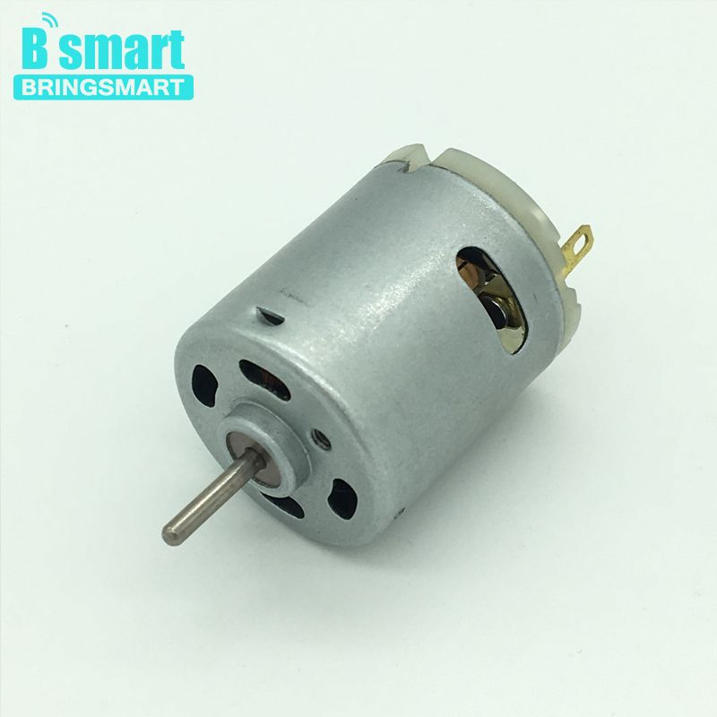
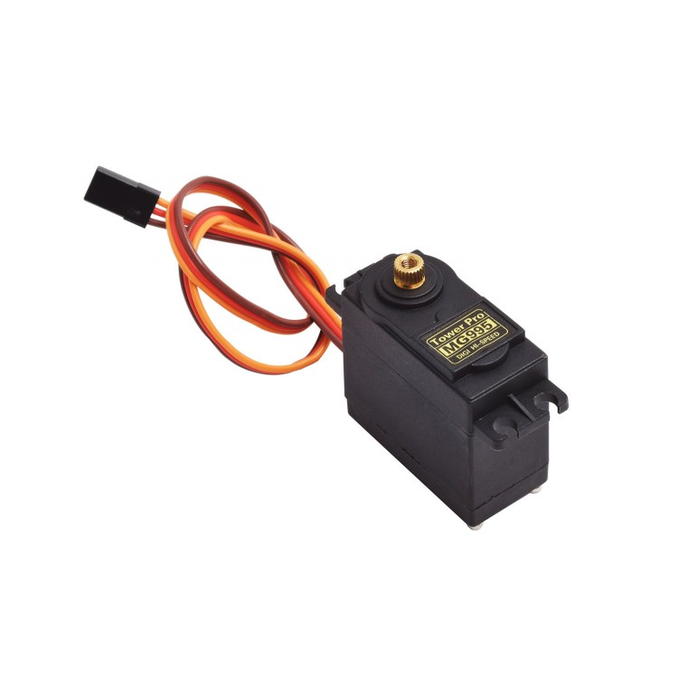
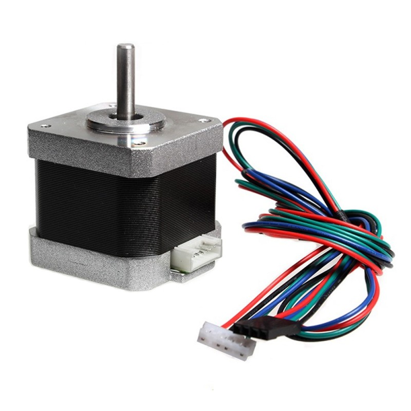

Documentación de conocimiento en temas generales, relevantes al proyecto.
 
# Mecánica

## TO-DO: pipetas y manejo de líquidos

## TO-DO: rulemanes, varillas y desplazamiento

# Electrónica

## Algunos motores eléctricos

Hay muchísimos tipos de motores, cada uno tiene características particulares. Además puede ser diferente la forma en que se controlan: cómo y cuando usar voltaje para operarlos.

Para esto último pueden usarse circuitos controladores o "drivers", diferentes para cada tipo de motor.

### El "común" de corriente directa

### Servo

Es un motor con electrónica adentro que le permite girar una cantidad de grados determinada, a partir de un circuito de feedback basado en un potenciómetro.

Estos motores hacen fuerza hasta llegar al ángulo específicado.

Tienen mayor torque y menor velocidad de revolución.

Para controlarlos hace falta voltaje y una señal de tipo "PWM".

### Paso a paso

Son motores de corriente directa, que también permiten especificar cuantos "pasos" girar.

La revolución se divide en 200 "pasos" típicamente.

Estos motores hacen fuerza para dar un "paso" a la vez.

Sin embargo, como no tienen control electrónico por feedback, si la resistencia no le permite dar alguno de sos pasos, uno nunca se entera de que se "perdieron pasos".

El motor se controla con la dirección de la corriente que se le aplica a sus bobinas.

En el proyecto miniCNC hicimos un paso a paso de cómo reciclar motores de diqueteras de CD/DVD: https://tecnologias.libres.cc/hiperobjetos/minicnc/wikis/instrucciones/2-electronica

## Controladores o "drivers" de motores eléctricos

### Paso a paso

Los "Pololu" son los más conocidos, y son los que usamos en el CNC Shield.

El "doble puente H" es otro circuito típico.

Hay diferentes tipos de motores paso a paso y cada uno requerirá un controlador adecuado.

### Servo

Se controlan con un generador de señales "PWM". Es una señal de voltaje con pulsos discretos (cuadrados) que se repiten a una frecuencia, amplitud ("duty cycle") y "ancho" determinados para cada servo.

Para el nuestro esta señal es ~50 Hz y ~5V, con un ancho de pulso 1-2 milisegundos.

### Motores "comunes"

En esta bolsa entran un montón de motores, que pueden controlarse de formas muy distintas.

Basicamente, uno puede regular el voltaje con una resistencia o mandando corriente en pulsos PWM (a amplitud de voltaje fija).

## TO-DO: Señales PWM

## TO-DO: Arduino
