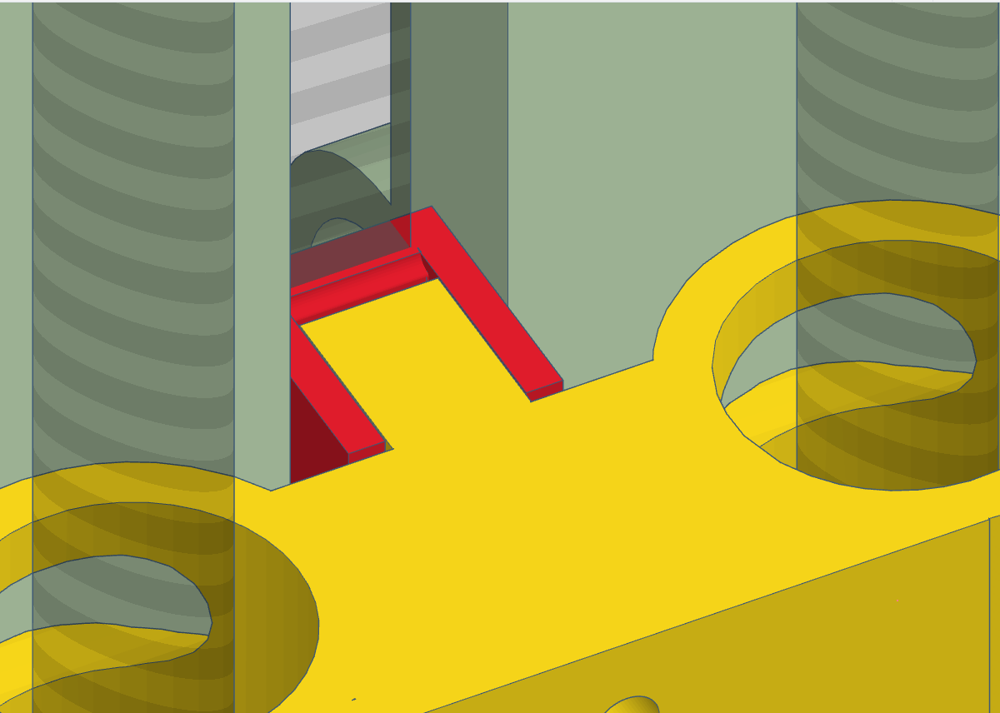

# Robot con correas y poleas

Con esto debería ir más rápido.

Un motor de 200 pasos con una polea de 7 mm de diámetro tiene precisión más que suficiente.

Los modelos base se parametrizan en FreeCAD, ver `freecad_base_models/`.

Las trabas para correas se bajaron de thingiverse, ver `thingiverse_belt_locks/`.

Los modelos base se ensamblan en TinkerCAD y se exportaron a la carpeta `tinkercad_exports/`.

# Models

Most models are now created directly in FreeCAD, the verification by "assembly" is still in Tinkercads.

That should change in the future, but it is not in schedule. Our current priority is to migrate remaining designs to FreeCAD (directly importing gears from OpenSCAD files).

## Tinkercad links

Links para editar:

* < v0.7.5: https://www.tinkercad.com/things/fmZqSN6cHmf-pippetin-grbl-v053/edit
* < v0.9.6: https://www.tinkercad.com/things/4lBHoceIFgf-pippetin-grbl-v096/edit
* v0.99: https://www.tinkercad.com/things/aSPLpupQbbE-copy-of-pippetin-grbl-v096/edit
  * Auxiliary workspace: https://www.tinkercad.com/things/lQpzvFQYTJL-powerful-blad/edit

Cosas servo:

* Viejo: https://www.tinkercad.com/things/2ZC4g48iKkl-servo-pipette-dock/edit
* Nuevo: https://www.tinkercad.com/things/4lBHoceIFgf-pippetin-grbl-v096/edit

Cosas tip probe:

* https://www.tinkercad.com/things/jhh7ATe5kqK-gilson-pipette-grbl-probing-accessory-for-tips/edit

Cosas ventilador Arduino:

* https://www.tinkercad.com/things/dVSJR8i45g9-unor3basecncshieldbasewithfaninverted/edit
* Creo que estos modelos deberian ir en la parte de electronica.

## v0.2

FreeCAD model of the X axis carriage / Z axis base.

TinkerCAD model of the Y axis base, with 8 mm mounting holes.

### Bugs

* Los tornillos del stepper chocan contra el carrito del X por un milímetro. Se soluciona fácil haciendo un huequito en donde encajan los tornillos para que entren un poco más en la pieza.
* El stepper del X choca contra la estructura de la base del Y. Si ensancho 2 mm la base del Y queda bien. Eso o comerle un poco al modelo. Creo que lo segundo es más fácil.

## v0.3

  * Slider Z para rulemanes de 50 mm de largo (dejando ~100-110 mm de recorrido).
  * Correcciones de la versión anterior.

## v0.4

* Separacion extra de 1 mm entre la base del stepper y las bases del eje Y & X.
* Imprimi el slider Z "largo" pero cortado al medio, a ver que pasa (?)

### v0.4.1

* Los huecos para los tornillos de las bases del Y quedaron para el lado equivocado.
* Los NEMA 17 que tengo tienen un cilindrito de 22 mm de diametro en la cara del eje que se choca con el soporte. Agregue el hueco.
* Agregar belt holder de thingiverse adaptados en tinkercad, para el eje X.

## v0.5.0

* Agregar belt tensioners de thingiverse adaptados en tinkercad, para el eje Y.

### v0.5.1

* Agregar belt holder al carrito del eje Y.

### v0.5.2

* Agregar belt "tensioner" al eje X (ruleman sin rosca para ajustar).
* Polea tensor eje X.

### v0.5.3

* Agregar disquitos para que no baile el ruleman en el tenor del eje Y.

### v0.5.4

* Varios cambios, no los registré :(

### v0.5.5

* Varios cambios, no los registré :(

## v0.6.0

* Parametrización de la prensa para fijar la correa GT2.
* Pieza para amarrar la correa al carrito del eje Z.
* Hice flip de la base de los steppers del eje X, que quedó para el otro lado respecto al huequito del medio para que quepa el stepper.
* Arreglé la distancia del tensor de correas del eje Y para no usar un ruleman.

### v0.6.1

* El carrito del Z salió mal, se traba contra la varilla del Z. Lo acorté 2 mm a ver qué pasa.

### v0.6.2

* Corrí el acople del stepper 1 mm hacia adelante.

#### Pendiente

- [x] Amarre del slider Z a la correa del eje Z.
- [x] Tensor de la correa del eje Z.
- [x] Descentrar el stepper Z para que la correa quede alineada con el fijador de la correa del carrito Z (ver foto abajo). En la versión 0.6.2 movi el acople del stepper Z 1 mm hacia adelante. Todavía quedó sin alinear el eje de abajo (el tensor de la correa Z).

### v0.7

Retomé el proyecto después de un rato largo.

### v0.7.1

Pequeño mal alineamiento del auero para las varillas del eje Z. Actualiza:

* `freecad_base_models/slider_X_base_Z_corregido.stl`

Aumenta la altura de las bases del eje Y, para acomodar los steppers del lado inferior. Actualiza:

* `tinkercad_exports/base_eje_y_Pippetin-grbl v0.7.1

### v0.7.2

Arreglar el carrito del eje Z que se traba (relacionado al issue #29) y agregarle un hueco para ajustar a las herramientas usando tuercas. Afecta:

* `tinkercad_exports/slider_eje_Z_v0.7.2.stl`

### v0.7.3

Versión salteada, hubo cambios en la base del stepper de la pipeta.

### v0.7.4

Unificar las piezas de la base del servo Z con una de las partes del carrito X / base Z.

Imprimir algunas poleas tensoras que me faltaban.

## v0.8.0

* Visto que la correa del eje Z era demasiado débil en cuanto a fuerza, revertí a la varilla roscada para el eje. Esta fue la sugerencia del "labo BA" también.
* Arregle la montura para el end stop, tomando medidas del que tengo en realidad.

Ver modelos en: https://www.tinkercad.com/things/1fi1E4R0CbN-pippetin-grbl-v080-threaded-z/edit

## v0.8.1

* El eje del stepper Z no parece centrado con las varillas o con algo, revisar. Parece estar 1-2 mm corrido hacia adelante.

**HECHO**: el problema era que en una di vuelta el stepper 180ª con la base, pero la base no era simetrica.

* La base del eje S no tiene los agujeros (horizontales) nuevos.

**HECHO**: el eje S fue completamente rediseñado.

* El carrito del eje S no agarra bien las tuercas que ajustan la base del eje S (de nuevo).

**HECHO**: Probé con agujeros muy justos, sin tolerancia, pero mas profundos que las tuercas, para encastrarlas a presión y que queden puestas. *Nota*: no es la mejor idea porque la presion esta en la direccion que separa las capas.

* Tengo que arreglar los carritos del eje Y, para que sean mas gordos.

**HECHO**: dupliqué su grosor y acomodé el espacio para el stepper X del lado interno.

* Modificar la base de los steppers Y para que sean mas resistentes (como se imprimen ahora, la tension de las correas hace fuerza en una direccion debil de la impresion).

**HECHO**: Ahora estan hechos de dos partes, que se unen con tornillos.

* El carrito del eje S golpea contra los tornillos que ajustan el servo de eyeccion de tips.

**HECHO**: el eje S fue rediseñado, no deberia estar más este problema.

## v0.8.2

Intento de aprovechar más el recorrido del eje Z haciendo un carrito Z minimalista.

Hotfix: habia unido la base de la pipeta con el carrito del Z, pero eso es incompatible con la propuesta de tool-change, asi que lo deshice.

## v0.8.3

Creo que el minicarrito del Z "minimalista" no va a ser util, se puede dejar la rosca flotando solita. Saco el modelo de esta versión.

El stepper del S sigue bailando por su masa. Hice un carrito para agarrarlo desde arriba.

Imprimi otro engranaje para el servo, espero que este quede mejor ajustado (igual al primero lo cagué a palos... y se la bancó).

Agregue agujeros para los tornillos que apretan las varillas del S contra las piezas. Esa idea funcionó muy bien incluso sin ellas y sin limar las varillas. Espero que con estas tuercas quede bien ajustado.

Reduje el "chanfle" del dock para la pipeta gilson, de 1 mm de cada lado a 0.5 mm de cada lado. Esto es porque al encajarla, obstruia demasiado el paso y quedaba deformado, en vez de calzar "justo".

# v0.9.0

Cambie el eje X para que use varillas de 12 mm con rulemanes lm12uu (21 mm de diametro en teoria, cuando me llegen tengo que medirlos).

Cambie el carrito del eje Y para que use el mismo sistema de tensionar poleas que el eje X. Es mucho más simple de usar y la junta no impone una limitación innecesaria en el recorrido de la correa.

- [ ] Considerar deshacerme de los tensores del eje Y dado el cambio anterior.

Agregué un carrito "minimalista" para el eje S (de la pipeta), para ver qué onda.

Agregué agujeros para apretar rulemanes y varillas a la mayoría de las bases y carritos.

- [ ] Queda pendiente agregar esto para ajustar los rulemanes lm12uu del carrito del eje X (y al resto del eje S también).

## v0.9.1

Increased S stepper coupling hole diameter (tolerance) from 22.20 mm to 22.40 mm. Now the ACME nut should fit through it without resistance at the topmost position.

Redesigned the S axis carriage to a simple and functional form.

White PLA looks nice! :)

Los agujeros para las tuercas que se usan para sujetar partes y varillas son demasiado estrechos. Ahora intenté con un poco más de tolerancia (+0.2 mm aprox). Por ahora solo la apliqué a los modelos del eje S.

Bug fix update: la distancia entre los rulemanes lm12uu era demasiada por algun motivo. En el modelo de FreeCAD estaba bien, no tuve que arreglar nada (pero de paso hice una mini limpieza). Luego en TinkerCAD, movi algunos agueros para tuercas y tornillos, para que sea más cómodo de ensamblar.

Minor change: increase tolerance in 12 mm rod holes a bit, the fit is too tight. Increased from 12.2 mm to 12.3 mm. Also made the rod-securing nut holes go through all.

## v0.9.2

Cambie de lado la base del stepper X, que me quedó mal puesta :/ 15 hs de impresión al dope por vago -.-

Ahora debería quedar bien.

Por gil me olvide de poner el agujero para el coupler / varilla roscada del Z. 

## v0.9.3

En las bases de los steppers reduje el "slot" donde calzan a 1 mm (antes 2). Esto es porque la correa quedaba demasiado por fuera de la base, y uqedaba desalineada de los sujetadores de correas.

Le saque material al carrito del eje X, porque iban a quedar desalineadas las correas (seguramente el problema apareció debido a efectos secundarios de pasar a lm12uu).

Le volvi a poner el hueco en "U" a la base del stepper Z.

**Nota**: es importante imprimir la base de los steppers con los huecos de los tornillos para arriba. Si no, por la impresión sobre "support", parte de la cabeza de los tornillos queda para afuera (y eso es malo para la base del stepper Z que despues tiene que atornillarse sobre el carrito X).

Aumente la tolerancia para poner las tuercas que apretan las varillas de 12mm del eje X.

Corregí los sujetadores de correas del eje Y. La parte dentada tenía que mirar para el otro lado.

Agregue un un huequito a los sujetadores de correas del eje X (los del lado "liso") para que los tornillos se metan un poco. Antes observé que la correa se trababa un poco con la cabeza de los tornillos al moverse.

Hotfix 1: deshice el cambio que removia material del carrito del eje X para alinear las correas con el stepper (porque al final no quedó del todo bien, porque entre que el stepper tiene esa protrusión y que la polea tambien agrega un poco distancia, terminó quedando peor que antes).

Hotfix 2: incrementé el diámetro y produndidad de los agujeros para los tornillos M3 (para las cabezas de los tornillos en realidad) en las piezas base de los stepper y belt tensioners.

Hotfix 3: agregue un separador de 3 mm para arreglar el problema de la "solapita" de la micropipeta chocando contra el ruleman del eje Z.

Hotfix 4: agregue un par de piezas para sostener el stepper S sobre las varillas del Z que salen para arriba. Es temporal pero viene bien mientras tanto. Lo que deberia hacer es diseñar un carrito del eje Z que sea una base posta, aprovechando esos 3 mm que tuve que agregar para separar la pipeta.

## v0.9.4

- [x] Armar un carrito del eje Z "alto" que se acople al minicarrito que está del lado de arriba.

* Instale el eje z completamente dado vuelta y funcionó. No era la idea, pero es lo que hay (sin el andamio no puedo hacer otra cosa, #27).
* Export para Mariano Beldorati: https://www.tinkercad.com/things/4lBHoceIFgf-pippetin-grbl-v093-lm12uu-x-axis/edit
* Moví el ruleman de la varilla roscada Z para que quede sujetado verticalmente por la estructura (y no se caiga).

## v0.9.5

### Pasacables

* Aumentar "underangle" a -4.5 grados.
* Hice un port del pasacables a FreeCAD y quedó bien. Usé esos modelos para prototipar acoples de los pasacables a otras cosas.

Ver: https://www.tinkercad.com/things/3vgmXZh5ky1-base-pasacables/edit

### Servo y base stepper "S"

* Roté el servo para que quede mejor orientado, y no moleste al pasacables.
* La base del stepper de la pipeta ahora tiene agujeros para pegarla a la placa "base" del eje Z.

Ver: https://www.tinkercad.com/things/cFK7Cm1zh40-sizzling-tumelo-uusam/edit

### End-stops

* Comencé a prototipar las bases y el caople de los end-stops.

- [ ] Quedó pendiente diseñar el end-stop del eje Z.

### Soporte hecho de perfiles de aluminio

* Armé las partes básicas para armar una base de aluminio usando perfiles "tipo bosch" 2020 y 3030.

- [ ] Mejorar el acople de las bases del eje Y al perfil de aluminio "3030".
- [ ] Agregarle piecitos a rosca para nivelar.
- [ ] Tiene un poco de juego en la dirección "x", se puede solucionar reforzando la junta entre el perfil 2020 y las patas 2020.

Ver: https://www.tinkercad.com/things/gpudXXik4lF-pippetin-grbl-v09x-perfiles-esctructura-2020-y-3030/edit

## v0.9.6

- [ ] Agregar tolerancia a los agujeros para tuercas de todos los modelos. Esto solo era urgente para la v0.9.1 porque se venció uno de los slots para tuercas mientras ajustaba el pipette holder al carrito del eje Z.
- [ ] Ver **To-do**...

# To-do

Todos los issues: https://github.com/naikymen/pipettin-grbl/issues

Varios:

- [x] El acople del stepper Z bloquea el avance del carrito Z (sobresale un poco de la base).
- [x] El stepper Z golpea contra la madera que tengo puesta como base.
- [x] La pipeta golpea contra la madera que tengo puesta como base. Solved: ya no hay madera, todo aluminio.
- [ ] Agregar los agujeros para montar end-stops (#35).

## Issue 43

https://github.com/naikymen/pipettin-grbl/issues/43

- [ ] Hacer que las varillas entren más ajustadas al carrito del eje X.
- [ ] Hacer que los rulemanes entren más ajustados al carrito del eje X.

## Issue 25

https://github.com/naikymen/pipettin-grbl/issues/25

https://www.tinkercad.com/things/jhh7ATe5kqK-gilson-pipette-grbl-probing-accessory-for-tips/edit

- [x] Rediseñar mecanismo de tip placement / calibración del eje Z.
- [ ] Migrar diseños a FreeCAD

## Issue 28

https://github.com/naikymen/pipettin-grbl/issues/28

- [x] El ventilador que tengo es más grande, y no encaja con la bisagra de esta base. Tengo que adaptarla.
